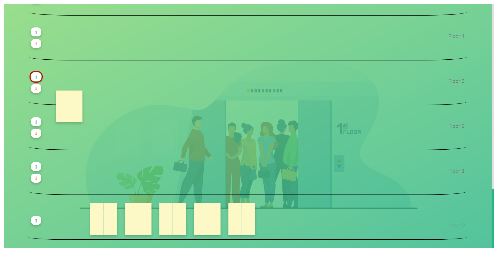

# Lift-Simulation

Created a web app where you can simulate lift mechanics for a client.

# UI Example

## About

**Here is my short Lift simulation intro**

✔️ User Input

1. My button will be initially disabled in starting and will be enabled after getting both the inputs.
2. The button will also get disabled if the user exceeded the limit of lifts after activating the button.

✔️ Lift Button

1. My lift button will glow red when clicked on it. It is to inform the user that the button is clicked and the lift is arriving.
2. 2 buttons can be clicked on the same floor to call 2 lifts. One for going up and other for going down.
3. Also added some hover effect on buttons so that the user feel like ki they are actually pressing the button.

✔️ Lift

1. Moving Lift cannot be interrupted by another's floor button call.
2. Not more than 2 lifts allowed on the same floor.
3. Made them responsive.
